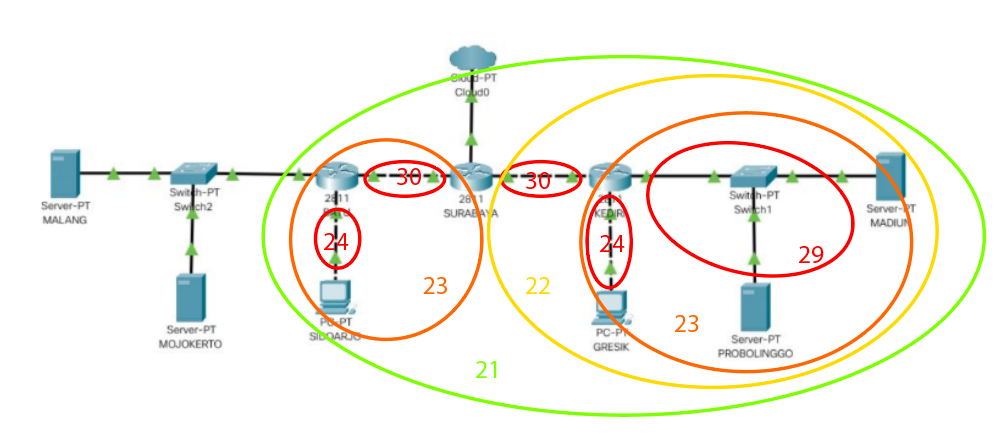

# Jarkom_Modul5_Lapres_B04

- Syubban Fakhriya  05111840000042
- Feraldy Nathanael 05111840000066

### (A) Membuat topologi jaringan sesuai dengan rancangan yang telah diberikan

```
uml_switch -unix switch1 > /dev/null < /dev/null &
uml_switch -unix switch2 > /dev/null < /dev/null &
uml_switch -unix switch3 > /dev/null < /dev/null &
uml_switch -unix switch4 > /dev/null < /dev/null &
uml_switch -unix switch5 > /dev/null < /dev/null &
uml_switch -unix switch6 > /dev/null < /dev/null &

**Router**

xterm -T SURABAYA -e linux ubd0=SURABAYA,jarkom umid=SURABAYA eth0=tuntap,,,10.151.74.21 eth1=daemon,,,switch3 eth2=daemon,,,switch5 mem=96M &
xterm -T BATU -e linux ubd0=BATU,jarkom umid=BATU eth0=daemon,,,switch3 eth1=daemon,,,switch4 eth2=daemon,,,switch2 mem=96M &
xterm -T KEDIRI -e linux ubd0=KEDIRI,jarkom umid=KEDIRI eth0=daemon,,,switch5 eth1=daemon,,,switch6 eth2=daemon,,,switch1 mem=96M &

**Server**

xterm -T MALANG -e linux ubd0=MALANG,jarkom umid=MALANG eth0=daemon,,,switch2 mem=128M &
xterm -T MOJOKERTO -e linux ubd0=MOJOKERTO,jarkom umid=MOJOKERTO eth0=daemon,,,switch2 mem=128M &
xterm -T MADIUN -e linux ubd0=MADIUN,jarkom umid=MADIUN eth0=daemon,,,switch1 mem=128M &
xterm -T PROBOLINGGO -e linux ubd0=PROBOLINGGO,jarkom umid=PROBOLINGGO eth0=daemon,,,switch1 mem=128M &


# Klien
xterm -T SIDOARJO -e linux ubd0=SIDOARJO,jarkom umid=SIDOARJO eth0=daemon,,,switch4 mem=96M &
xterm -T GRESIK -e linux ubd0=GRESIK,jarkom umid=GRESIK eth0=daemon,,,switch6 mem=96M &
```

### (B) Melakukan subnetting dengan VLSM atau CIDR




### (C) Melakukan routing

```
route add -net 192.168.0.0 netmask 255.255.254.0 gw 192.168.2.2
route add -net 192.168.4.0 netmask 255.255.255.0 gw 192.168.5.2
route add -net 10.151.83.40 netmask 255.255.255.248 gw 192.168.5.2
```

### (D) Memberikan ip pada subnet **SIDOARJO** dan **GRESIK** secara dinamis menggunakan bantuan DHCP SERVER (selain itu menggunakan ip static)

```
nano /etc/dhcp/dhcpd.conf (MOJOKERTO)

subnet 192.168.4.0 netmask 255.255.255.0 {
    range 192.168.4.2 192.168.4.254;
    option routers 192.168.4.1;
    option broadcast-address 192.168.4.255;
    option domain-name-servers 10.151.77.74;
    default-lease-time 600;
    max-lease-time 7200;
}

subnet 192.168.0.0 netmask 255.255.255.0 {
    range 192.168.0.2 192.168.0.254;
    option routers 192.168.0.1;
    option broadcast-address 192.168.0.255;
    option domain-name-servers 10.151.77.74;
    default-lease-time 600;
    max-lease-time 7200;
}

subnet 10.151.83.40 netmask 255.255.255.248 {

}

service isc-dhcp-server restart (Mojokerto)


---------------------------------
Cara install relay

apt-get install isc-dhcp-relay (BATU, KEDIRI)

#bakal keluar installernya trus diisi
IP MOJO, kosong, kosong

service networking restart (GRESIK, SIDOARJO)
```

```
router-------------
SURABAYA________________________

auto eth0
iface eth0 inet static
address 10.151.74.22
netmask 255.255.255.252
gateway 10.151.74.23

auto eth1
iface eth1 inet static
address 192.168.5.1
netmask 255.255.255.252

auto eth2
iface eth2 inet static
address 192.168.2.1
netmask 255.255.255.252

BATU_____________________________

auto eth0
iface eth0 inet static
address 192.168.5.2
netmask 255.255.255.252
gateway 192.168.5.1


auto eth1
iface eth1 inet static
address 192.168.4.1
netmask 255.255.255.0

auto eth2
iface eth2 inet static
address 10.151.83.41 (server malang)
netmask 255.255.255.248

KEDIRI_____________________________

auto eth0
iface eth0 inet static
address 192.168.2.2
netmask 255.255.255.252
gateway 192.168.2.1

auto eth1
iface eth1 inet static
address 192.168.0.1
netmask 255.255.255.0

auto eth2
iface eth2 inet static
address 192.168.1.1
netmask 255.255.255.248


client----------------

ip dinamis

server

MALANG____________________

auto eth0
iface eth0 inet static
address 10.151.83.42 (ip malang tiap kelompok)
netmask 255.255.255.248
gateway  10.151.83.43 (ip malang + 1)

MOJOKERTO________________

auto eth0
iface eth0 inet static
address 10.151.83.43 (ip mojokerto tiap kelompok)
netmask 255.255.255.248
gateway 10.151.83.43 (gateway malang)

MADIUN____________________

auto eth0
iface eth0 inet static
address 192.168.1.2
netmask 255.255.255.248
gateway 192.168.1.1

PROBOLINGGO____________

auto eth0
iface eth0 inet static
address 192.168.1.3
netmask 255.255.255.248
gateway 192.168.1.1
```

### (1) Mengkonfigurasi **SURABAYA** menggunakan iptables tanpa MASQUERADE

```
iptables -t nat -A POSTROUTING -s 192.168.0.0/16 -o eth0 -j SNAT --to-source 10.151.74.22
```

### (2) Mendrop semua akses SSH dari luar topologi pada server yang memiliki ip DMZ (DHCP dan DNS SERVER) pada **SURABAYA**

```
iptables -A FORWARD -p tcp --dport 22 -d 10.151.83.40/29 -i eth0 -j DROP
```

### (3) Membatasi DHCP dan DNS server hanya boleh menerima maksimal 3 koneksi ICMP secara bersamaan yang berasal dari mana saja menggunakan **iptables pada masing-masing server**, selebihnya akan di drop.

```
iptables -A INPUT -p icmp -m connlimit --connlimit-above 3 --connlimit-mask 0 -j DROP
```

### (4) Akses dari subnet **SIDOARJO** ke **MALANG** hanya diperbolehkan pada pukul 07.00 - 17.00 dari senin - jumat

```
iptables -A INPUT -s 192.168.4.0/24 -m time --timestart 07:00 --timestop 17:00 --weekdays Mon,Tue,Wed,Thu,Fri -j ACCEPT
iptables -A INPUT -s 192.168.0.0/24 -m time --timestart 17:00 --timestop 00:00 -j ACCEPT
iptables -A INPUT -s 192.168.0.0/24 -m time --timestart 00:00 --timestop 07:00 -j ACCEPT
iptables -A INPUT -s 192.168.4.0/24 -j REJECT
iptables -A INPUT -s 192.168.0.0/24 -j REJECT
```

### (5) Akses dari subnet **GRESIK** ke **MALANG** hanya diperbolehkan pada pukul 17.00 - 07.00 setiap hari

```
iptables -A INPUT -s 192.168.4.0/24 -m time --timestart 07:00 --timestop 17:00 --weekdays Mon,Tue,Wed,Thu,Fri -j ACCEPT
iptables -A INPUT -s 192.168.0.0/24 -m time --timestart 17:00 --timestop 00:00 -j ACCEPT
iptables -A INPUT -s 192.168.0.0/24 -m time --timestart 00:00 --timestop 07:00 -j ACCEPT
iptables -A INPUT -s 192.168.4.0/24 -j REJECT
iptables -A INPUT -s 192.168.0.0/24 -j REJECT
```

### (6) **SURABAYA** disetting sehingga setiap request dari client yang mengakses **DNS Server** akan didistribusikan **secara bergantian** pada **PROBOLINGGO** port 80 dan **MADIUN** port 80

```
iptables -A PREROUTING -t nat -p tcp -d 192.168.1.10 --dport 80 -m statistic --mode nth --every 2 --packet 0 -j DNAT --to-destination 192.168.1.2
iptables -A PREROUTING -t nat -p tcp -d 192.168.1.10 --dport 80 -j DNAT --to-destination 192.168.1.3
iptables -t nat -A POSTROUTING -p tcp --dport 80 -d 192.168.1.2 -j SNAT --to-source 192.168.1.10
iptables -t nat -A POSTROUTING -p tcp --dport 80 -d 192.168.1.3 -j SNAT --to-source 192.168.1.10
```

### (7) Semua paket yang didrop oeh firewall (dalam topologi) tercatat dalam log pada setiap UML yang memiliki aturan drop.

```
**di surabaya (gantiin nomer 2):**

iptables -N LOGGING
iptables -A FORWARD -p tcp --dport 22 -d 10.151.83.40/29 -i eth0 -j LOGGING
iptables -A LOGGING -m limit --limit 2/min -j LOG --log-prefix "PDROP: " --log-level info
iptables -A LOGGING -j DROP

**di malang mojo (gantiin nomer 3):**

iptables -N LOGGING
iptables -A INPUT -p icmp -m connlimit --connlimit-above 3 --connlimit-mask 0 -j LOGGING
iptables -A LOGGING -m limit --limit 2/min -j LOG --log-prefix "PDROP: " --log-level info
iptables -A LOGGING -j DROP

**atau coba ini**

iptables -N LOGGING
iptables -A FORWARD -p tcp --dport 22 -d 10.151.83.40/29 -i eth0 -j LOGGING
iptables -A LOGGING -j LOG --log-prefix "PDROP: " --log-level info
iptables -A LOGGING -j DROP

**di malang mojo (gantiin nomer 3):**

iptables -N LOGGING
iptables -A INPUT -p icmp -m connlimit --connlimit-above 3 --connlimit-mask 0 -j LOGGING
#iptables -A LOGGING -j LOG --log-prefix "PDROP: " --log-level info
#iptables -A LOGGING -j DROP
```
